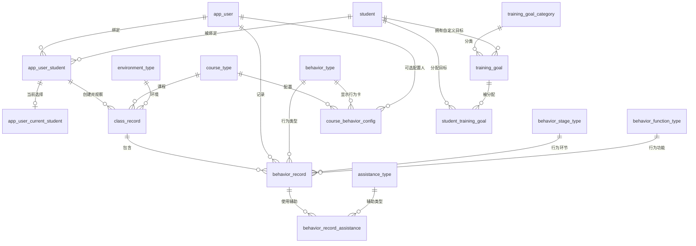

# 特殊教育课堂助手数据库数据字典

## 1. 文档基准

本文档直接读取本机运行中的 MySQL 数据库 `special_ed_assistant`，不是仅根据建表脚本推导。

云端同步目标：[数据字典](https://nankai.feishu.cn/wiki/U47LwOjJrixBAHkZ8wzcS39anc9)。后续数据库结构、字典数据或实测快照更新应同时维护本文件和该飞书文档。

| 项目 | 实测值 |
|---|---|
| 快照时间 | `2026-07-21 17:11:31`（Asia/Shanghai） |
| MySQL | `8.0.45 MySQL Community Server - GPL` |
| 数据库 | `special_ed_assistant` |
| 当前结构版本 | `2.4.0` |
| 已应用版本 | `2.0.0`、`2.1.0`、`2.2.0`、`2.3.0`、`2.4.0` |
| 默认字符集 | `utf8mb4` |
| 默认排序规则 | `utf8mb4_0900_ai_ci` |
| 存储引擎 | 全部为 `InnoDB` |
| 基础表 | 18 张 |
| 字段 | 82 个 |
| 索引 | 43 个，包含主键和唯一索引 |
| 外键 | 20 个 |
| CHECK 约束 | 8 个，全部启用 |
| 视图、触发器、存储过程、事件 | 均为 0 |

字段表中的约定：

- `PRI`：字段属于主键。
- `UNI`：字段属于唯一索引。
- `MUL`：字段属于普通或非唯一复合索引。
- `NULL`：字段允许空值，且未设置其他默认值。
- `无`：字段必填且没有默认值，插入时必须提供。
- `tinyint(1)`：MySQL 中用于保存布尔值，`0=false`、`1=true`。

## 2. 表关系

## 3. 当前数据量

以下为快照时的精确 `COUNT(*)`，业务运行后会变化。

| 表名 | 行数 | 类型 |
|---|---:|---|
| `app_user` | 3 | 用户主数据 |
| `app_user_current_student` | 3 | 当前学生状态 |
| `app_user_student` | 6 | 用户学生绑定 |
| `assistance_type` | 9 | 辅助方式字典 |
| `behavior_function_type` | 4 | 行为功能字典 |
| `behavior_record` | 0 | 行为发生记录 |
| `behavior_record_assistance` | 0 | 行为辅助明细 |
| `behavior_stage_type` | 0 | 行为环节字典，待提供 |
| `behavior_type` | 16 | 行为类型字典 |
| `class_record` | 0 | 随班记录 |
| `course_behavior_config` | 13 | 课程行为卡配置 |
| `course_type` | 11 | 课程字典 |
| `environment_type` | 9 | 环境字典 |
| `schema_migration` | 4 | 迁移版本 |
| `student` | 6 | 学生主数据 |
| `student_training_goal` | 0 | 学生训练目标分配 |
| `training_goal` | 165 | 训练目标库 |
| `training_goal_category` | 11 | 训练目标分类 |

## 4. 字段字典

### 4.1 `schema_migration` - 数据库迁移版本

主键：`version`。当前保存 `2.0.0`、`2.1.0`、`2.2.0`、`2.3.0` 和 `2.4.0`。

| 序号 | 字段 | 类型 | 空 | 默认值 | 键 | 说明 |
|---:|---|---|---|---|---|---|
| 1 | `version` | `varchar(32)` | 否 | 无 | PRI | 已成功应用的数据库结构版本 |
| 2 | `applied_at` | `timestamp` | 否 | `CURRENT_TIMESTAMP` | - | 版本应用时间，数据库自动生成 |

### 4.2 `app_user` - 用户/当前教师

| 序号 | 字段 | 类型 | 空 | 默认值 | 键 | 说明 |
|---:|---|---|---|---|---|---|
| 1 | `id` | `bigint unsigned` | 否 | 无 | PRI | 用户主键，自增 |
| 2 | `teacher_id` | `varchar(16)` | 是 | `NULL` | UNI | 白名单教师 ID，例如 `t001`；非教师账号可为空 |
| 3 | `avatar` | `varchar(500)` | 是 | `NULL` | - | 头像地址 |
| 4 | `name` | `varchar(64)` | 否 | 无 | - | 用户姓名 |
| 5 | `school` | `varchar(128)` | 是 | `NULL` | - | 所属学校 |
| 6 | `position` | `varchar(64)` | 是 | `NULL` | - | 职位或教师类型展示文本 |
| 7 | `role` | `enum('RESOURCE_TEACHER','SHADOW_TEACHER','PARENT')` | 否 | 无 | - | 资源教师、影子老师或家长 |

### 4.3 `student` - 学生

| 序号 | 字段 | 类型 | 空 | 默认值 | 键 | 说明 |
|---:|---|---|---|---|---|---|
| 1 | `id` | `bigint unsigned` | 否 | 无 | PRI | 学生主键，自增 |
| 2 | `student_code` | `varchar(16)` | 否 | 无 | UNI | 对外学生编号，例如 `s001` |
| 3 | `name` | `varchar(64)` | 否 | 无 | - | 学生姓名 |
| 4 | `gender` | `enum('MALE','FEMALE')` | 是 | `NULL` | - | 性别 |
| 5 | `age` | `tinyint unsigned` | 是 | `NULL` | - | 年龄 |
| 6 | `class_name` | `varchar(64)` | 是 | `NULL` | - | 班级名称 |
| 7 | `disability_type` | `varchar(64)` | 是 | `NULL` | - | 障碍类型或支持类别 |
| 8 | `support_goal` | `varchar(255)` | 是 | `NULL` | - | 学生总体支持目标 |
| 9 | `remark` | `varchar(500)` | 是 | `NULL` | - | 学生备注 |

### 4.4 `app_user_student` - 用户与学生绑定

联合主键：`(user_id, student_id)`。

| 序号 | 字段 | 类型 | 空 | 默认值 | 键 | 说明 |
|---:|---|---|---|---|---|---|
| 1 | `user_id` | `bigint unsigned` | 否 | 无 | PRI | 绑定用户 ID |
| 2 | `student_id` | `bigint unsigned` | 否 | 无 | PRI | 绑定学生 ID |

### 4.5 `app_user_current_student` - 用户当前学生

一名用户最多保存一名当前学生。联合外键 `(user_id, student_id)` 强制当前学生必须已与该用户绑定。

| 序号 | 字段 | 类型 | 空 | 默认值 | 键 | 说明 |
|---:|---|---|---|---|---|---|
| 1 | `user_id` | `bigint unsigned` | 否 | 无 | PRI | 用户 ID，同时为主键 |
| 2 | `student_id` | `bigint unsigned` | 否 | 无 | MUL | 当前选中的学生 ID |

### 4.6 `course_type` - 课程字典

| 序号 | 字段 | 类型 | 空 | 默认值 | 键 | 说明 |
|---:|---|---|---|---|---|---|
| 1 | `code` | `varchar(64)` | 否 | 无 | PRI | 稳定课程代码 |
| 2 | `label` | `varchar(64)` | 否 | 无 | - | 中文名称 |

### 4.7 `environment_type` - 环境字典

| 序号 | 字段 | 类型 | 空 | 默认值 | 键 | 说明 |
|---:|---|---|---|---|---|---|
| 1 | `code` | `varchar(64)` | 否 | 无 | PRI | 稳定环境代码 |
| 2 | `label` | `varchar(64)` | 否 | 无 | - | 中文名称 |

### 4.8 `behavior_type` - 行为类型字典

| 序号 | 字段 | 类型 | 空 | 默认值 | 键 | 说明 |
|---:|---|---|---|---|---|---|
| 1 | `code` | `varchar(64)` | 否 | 无 | PRI | 行为卡片稳定代码 |
| 2 | `label` | `varchar(64)` | 否 | 无 | - | 中文名称 |

### 4.9 `behavior_stage_type` - 行为环节字典

当前为空，表结构已保留，等待前端或业务方提供正式选项。

| 序号 | 字段 | 类型 | 空 | 默认值 | 键 | 说明 |
|---:|---|---|---|---|---|---|
| 1 | `code` | `varchar(64)` | 否 | 无 | PRI | 行为环节稳定代码 |
| 2 | `label` | `varchar(64)` | 否 | 无 | - | 中文名称 |

### 4.10 `behavior_function_type` - 行为功能字典

当前固定为 `ATTENTION`、`TANGIBLE`、`ESCAPE`、`SENSORY` 4 项。

| 序号 | 字段 | 类型 | 空 | 默认值 | 键 | 说明 |
|---:|---|---|---|---|---|---|
| 1 | `code` | `varchar(64)` | 否 | 无 | PRI | 行为功能稳定代码 |
| 2 | `label` | `varchar(64)` | 否 | 无 | - | 中文名称 |

### 4.11 `assistance_type` - 辅助方式字典

| 序号 | 字段 | 类型 | 空 | 默认值 | 键 | 说明 |
|---:|---|---|---|---|---|---|
| 1 | `code` | `varchar(64)` | 否 | 无 | PRI | 辅助方式稳定代码 |
| 2 | `label` | `varchar(64)` | 否 | 无 | - | 中文名称 |
| 3 | `group_code` | `enum('INTERNAL_STIMULUS','EXTERNAL_STIMULUS')` | 否 | 无 | - | 刺激内辅助或刺激外辅助 |
| 4 | `display_order` | `smallint unsigned` | 否 | 无 | UNI | 唯一展示顺序 |

### 4.12 `class_record` - 随班记录

一行表示一次独立课堂观察；相同学生、日期、课程和环境可以存在多行。

| 序号 | 字段 | 类型 | 空 | 默认值 | 键 | 说明 |
|---:|---|---|---|---|---|---|
| 1 | `id` | `bigint unsigned` | 否 | 无 | PRI | 随班记录主键，自增 |
| 2 | `student_id` | `bigint unsigned` | 否 | 无 | MUL | 被观察学生 |
| 3 | `creator_id` | `bigint unsigned` | 否 | 无 | MUL | 创建用户 |
| 4 | `record_date` | `date` | 否 | 无 | - | 记录自然日 |
| 5 | `course_code` | `varchar(64)` | 否 | 无 | MUL | 课程代码 |
| 6 | `course_other_description` | `varchar(255)` | 是 | `NULL` | - | 课程为其他时的补充说明 |
| 7 | `environment_code` | `varchar(64)` | 否 | 无 | MUL | 环境代码 |
| 8 | `environment_other_description` | `varchar(255)` | 是 | `NULL` | - | 环境为其他时的补充说明 |
| 9 | `observation_duration_minutes` | `smallint unsigned` | 否 | 无 | - | 观察时长，单位分钟，必须大于 0 |
| 10 | `overall_remark` | `varchar(1000)` | 是 | `NULL` | - | 本周期行为备注/课堂整体备注 |

### 4.13 `behavior_record` - 行为发生记录

一行代表一次行为发生；快速记录和补记均新增一行，频次通过行数统计。

| 序号 | 字段 | 类型 | 空 | 默认值 | 键 | 说明 |
|---:|---|---|---|---|---|---|
| 1 | `id` | `bigint unsigned` | 否 | 无 | PRI | 行为记录主键，自增 |
| 2 | `class_record_id` | `bigint unsigned` | 否 | 无 | MUL | 所属随班记录 |
| 3 | `creator_id` | `bigint unsigned` | 否 | 无 | MUL | 记录用户 |
| 4 | `occurred_at` | `datetime(3)` | 否 | 无 | - | 行为发生时间，精确到毫秒 |
| 5 | `behavior_code` | `varchar(64)` | 否 | 无 | MUL | 行为类型代码 |
| 6 | `duration_minutes` | `smallint unsigned` | 是 | `NULL` | - | 持续时间，单位分钟；非空时必须大于 0 |
| 7 | `stage_code` | `varchar(64)` | 是 | `NULL` | MUL | 行为环节代码 |
| 8 | `antecedent_text` | `varchar(1000)` | 是 | `NULL` | - | A：行为发生前的情况 |
| 9 | `behavior_description` | `varchar(1000)` | 是 | `NULL` | - | B：具体行为表现 |
| 10 | `consequence_text` | `varchar(1000)` | 是 | `NULL` | - | C：行为发生后的结果 |
| 11 | `function_code` | `varchar(64)` | 是 | `NULL` | MUL | 行为功能代码 |
| 12 | `assistance_result_text` | `varchar(1000)` | 是 | `NULL` | - | 辅助结果自由文本 |
| 13 | `detail_saved` | `tinyint(1)` | 否 | `0` | - | 是否执行过详细记录保存；一旦为 1 不再恢复为 0 |

### 4.14 `behavior_record_assistance` - 行为辅助方式明细

联合主键：`(behavior_record_id, assistance_code)`，同一行为记录不能重复选择同一种辅助方式。

| 序号 | 字段 | 类型 | 空 | 默认值 | 键 | 说明 |
|---:|---|---|---|---|---|---|
| 1 | `behavior_record_id` | `bigint unsigned` | 否 | 无 | PRI | 行为记录 ID |
| 2 | `assistance_code` | `varchar(64)` | 否 | 无 | PRI | 辅助方式代码 |
| 3 | `content` | `varchar(500)` | 是 | `NULL` | - | 该辅助方式的可选补充内容；空白输入由后端归一化为 `NULL` |

### 4.15 `course_behavior_config` - 课程行为卡配置

联合主键：`(course_code, behavior_code)`。决定指定课程页面展示哪些行为卡片。

| 序号 | 字段 | 类型 | 空 | 默认值 | 键 | 说明 |
|---:|---|---|---|---|---|---|
| 1 | `course_code` | `varchar(64)` | 否 | 无 | PRI | 课程代码 |
| 2 | `behavior_code` | `varchar(64)` | 否 | 无 | PRI | 行为类型代码 |
| 3 | `configured_by_user_id` | `bigint unsigned` | 是 | `NULL` | MUL | 配置用户；为空表示系统内置配置 |

### 4.16 `training_goal_category` - 训练目标分类

| 序号 | 字段 | 类型 | 空 | 默认值 | 键 | 说明 |
|---:|---|---|---|---|---|---|
| 1 | `code` | `varchar(64)` | 否 | 无 | PRI | 分类稳定代码 |
| 2 | `label` | `varchar(128)` | 否 | 无 | - | 分类名称 |
| 3 | `display_order` | `smallint unsigned` | 否 | 无 | UNI | 唯一展示顺序 |
| 4 | `is_custom` | `tinyint(1)` | 否 | `0` | - | 是否为自定义分类 |

### 4.17 `training_goal` - 训练目标库

标准目标使用 `standard_number` 作为稳定业务编号；数据库 `id` 不应替代业务编号。

| 序号 | 字段 | 类型 | 空 | 默认值 | 键 | 说明 |
|---:|---|---|---|---|---|---|
| 1 | `id` | `bigint unsigned` | 否 | 无 | PRI | 训练目标主键，自增 |
| 2 | `standard_number` | `smallint unsigned` | 是 | `NULL` | UNI | 标准目标编号；标准目标必填，自定义目标必须为空 |
| 3 | `category_code` | `varchar(64)` | 否 | 无 | MUL | 目标分类代码 |
| 4 | `goal_text` | `varchar(500)` | 否 | 无 | - | 目标内容，去除首尾空格后不能为空 |
| 5 | `goal_type` | `enum('STANDARD','CUSTOM')` | 否 | 无 | - | 标准目标或自定义目标 |
| 6 | `owner_student_id` | `bigint unsigned` | 是 | `NULL` | MUL | 自定义目标所属学生；标准目标必须为空 |

### 4.18 `student_training_goal` - 学生训练目标分配

`(student_id, goal_id)` 唯一，防止同一学生重复分配同一目标。

| 序号 | 字段 | 类型 | 空 | 默认值 | 键 | 说明 |
|---:|---|---|---|---|---|---|
| 1 | `id` | `bigint unsigned` | 否 | 无 | PRI | 分配记录主键，自增 |
| 2 | `student_id` | `bigint unsigned` | 否 | 无 | MUL | 学生 ID |
| 3 | `goal_id` | `bigint unsigned` | 否 | 无 | MUL | 训练目标 ID |
| 4 | `initial_level` | `varchar(32)` | 否 | 无 | - | 学期初等级，去除首尾空格后不能为空 |
| 5 | `current_level` | `varchar(32)` | 否 | 无 | - | 当前等级，去除首尾空格后不能为空 |
| 6 | `phase` | `tinyint unsigned` | 否 | `1` | - | 阶段，只允许 1、2、3 |
| 7 | `status` | `enum('NOT_STARTED','IN_PROGRESS','COMPLETED','PAUSED')` | 否 | `NOT_STARTED` | MUL | 未开始、进行中、已完成或暂停 |

## 5. 索引字典

`唯一=是` 包括主键和唯一索引。

| 表 | 索引名 | 唯一 | 字段顺序 |
|---|---|---|---|
| `app_user` | `PRIMARY` | 是 | `id` |
| `app_user` | `uk_app_user_teacher_id` | 是 | `teacher_id` |
| `app_user_current_student` | `PRIMARY` | 是 | `user_id` |
| `app_user_current_student` | `fk_app_user_current_student_binding` | 否 | `user_id, student_id` |
| `app_user_current_student` | `idx_app_user_current_student_student` | 否 | `student_id` |
| `app_user_student` | `PRIMARY` | 是 | `user_id, student_id` |
| `app_user_student` | `idx_app_user_student_student` | 否 | `student_id` |
| `assistance_type` | `PRIMARY` | 是 | `code` |
| `assistance_type` | `uk_assistance_type_display_order` | 是 | `display_order` |
| `behavior_function_type` | `PRIMARY` | 是 | `code` |
| `behavior_record` | `PRIMARY` | 是 | `id` |
| `behavior_record` | `idx_behavior_record_behavior` | 否 | `behavior_code` |
| `behavior_record` | `idx_behavior_record_class_behavior_time` | 否 | `class_record_id, behavior_code, occurred_at, id` |
| `behavior_record` | `idx_behavior_record_creator` | 否 | `creator_id` |
| `behavior_record` | `idx_behavior_record_function` | 否 | `function_code` |
| `behavior_record` | `idx_behavior_record_stage` | 否 | `stage_code` |
| `behavior_record_assistance` | `PRIMARY` | 是 | `behavior_record_id, assistance_code` |
| `behavior_record_assistance` | `idx_behavior_record_assistance_type` | 否 | `assistance_code` |
| `behavior_stage_type` | `PRIMARY` | 是 | `code` |
| `behavior_type` | `PRIMARY` | 是 | `code` |
| `class_record` | `PRIMARY` | 是 | `id` |
| `class_record` | `idx_class_record_course` | 否 | `course_code` |
| `class_record` | `idx_class_record_creator_student` | 否 | `creator_id, student_id` |
| `class_record` | `idx_class_record_environment` | 否 | `environment_code` |
| `class_record` | `idx_class_record_student_date` | 否 | `student_id, record_date` |
| `course_behavior_config` | `PRIMARY` | 是 | `course_code, behavior_code` |
| `course_behavior_config` | `idx_course_behavior_config_behavior` | 否 | `behavior_code` |
| `course_behavior_config` | `idx_course_behavior_config_user` | 否 | `configured_by_user_id` |
| `course_type` | `PRIMARY` | 是 | `code` |
| `environment_type` | `PRIMARY` | 是 | `code` |
| `schema_migration` | `PRIMARY` | 是 | `version` |
| `student` | `PRIMARY` | 是 | `id` |
| `student` | `uk_student_student_code` | 是 | `student_code` |
| `student_training_goal` | `PRIMARY` | 是 | `id` |
| `student_training_goal` | `idx_student_training_goal_goal` | 否 | `goal_id` |
| `student_training_goal` | `idx_student_training_goal_student_status` | 否 | `student_id, status` |
| `student_training_goal` | `uk_student_training_goal_student_goal` | 是 | `student_id, goal_id` |
| `training_goal` | `PRIMARY` | 是 | `id` |
| `training_goal` | `idx_training_goal_category_type` | 否 | `category_code, goal_type` |
| `training_goal` | `idx_training_goal_owner` | 否 | `owner_student_id` |
| `training_goal` | `uk_training_goal_standard_number` | 是 | `standard_number` |
| `training_goal_category` | `PRIMARY` | 是 | `code` |
| `training_goal_category` | `uk_training_goal_category_display_order` | 是 | `display_order` |

## 6. 外键字典

所有外键的更新规则均为 `NO ACTION`。

| 子表 | 外键名 | 子字段 | 父表 | 父字段 | 删除规则 |
|---|---|---|---|---|---|
| `app_user_current_student` | `fk_app_user_current_student_binding` | `user_id, student_id` | `app_user_student` | `user_id, student_id` | `CASCADE` |
| `app_user_student` | `fk_app_user_student_student` | `student_id` | `student` | `id` | `CASCADE` |
| `app_user_student` | `fk_app_user_student_user` | `user_id` | `app_user` | `id` | `CASCADE` |
| `behavior_record` | `fk_behavior_record_behavior` | `behavior_code` | `behavior_type` | `code` | `NO ACTION` |
| `behavior_record` | `fk_behavior_record_class_record` | `class_record_id` | `class_record` | `id` | `CASCADE` |
| `behavior_record` | `fk_behavior_record_creator` | `creator_id` | `app_user` | `id` | `NO ACTION` |
| `behavior_record` | `fk_behavior_record_function` | `function_code` | `behavior_function_type` | `code` | `NO ACTION` |
| `behavior_record` | `fk_behavior_record_stage` | `stage_code` | `behavior_stage_type` | `code` | `NO ACTION` |
| `behavior_record_assistance` | `fk_behavior_record_assistance_record` | `behavior_record_id` | `behavior_record` | `id` | `CASCADE` |
| `behavior_record_assistance` | `fk_behavior_record_assistance_type` | `assistance_code` | `assistance_type` | `code` | `NO ACTION` |
| `class_record` | `fk_class_record_course` | `course_code` | `course_type` | `code` | `NO ACTION` |
| `class_record` | `fk_class_record_creator_student` | `creator_id, student_id` | `app_user_student` | `user_id, student_id` | `NO ACTION` |
| `class_record` | `fk_class_record_environment` | `environment_code` | `environment_type` | `code` | `NO ACTION` |
| `course_behavior_config` | `fk_course_behavior_config_behavior` | `behavior_code` | `behavior_type` | `code` | `NO ACTION` |
| `course_behavior_config` | `fk_course_behavior_config_course` | `course_code` | `course_type` | `code` | `NO ACTION` |
| `course_behavior_config` | `fk_course_behavior_config_user` | `configured_by_user_id` | `app_user` | `id` | `SET NULL` |
| `student_training_goal` | `fk_student_training_goal_goal` | `goal_id` | `training_goal` | `id` | `CASCADE` |
| `student_training_goal` | `fk_student_training_goal_student` | `student_id` | `student` | `id` | `CASCADE` |
| `training_goal` | `fk_training_goal_category` | `category_code` | `training_goal_category` | `code` | `NO ACTION` |
| `training_goal` | `fk_training_goal_owner` | `owner_student_id` | `student` | `id` | `CASCADE` |

## 7. CHECK 约束

| 表 | 约束名 | 规则 |
|---|---|---|
| `behavior_record` | `chk_behavior_record_duration` | `duration_minutes IS NULL OR duration_minutes > 0` |
| `class_record` | `chk_class_record_duration` | `observation_duration_minutes > 0` |
| `student_training_goal` | `chk_student_training_goal_current_level` | `CHAR_LENGTH(TRIM(current_level)) > 0` |
| `student_training_goal` | `chk_student_training_goal_initial_level` | `CHAR_LENGTH(TRIM(initial_level)) > 0` |
| `student_training_goal` | `chk_student_training_goal_phase` | `phase BETWEEN 1 AND 3` |
| `training_goal` | `chk_training_goal_owner` | 标准目标的 `owner_student_id` 必须为空；自定义目标必须非空 |
| `training_goal` | `chk_training_goal_standard_number` | 标准目标的 `standard_number` 必须非空；自定义目标必须为空 |
| `training_goal` | `chk_training_goal_text` | `CHAR_LENGTH(TRIM(goal_text)) > 0` |

## 8. 实际枚举和字典值

### 8.1 用户角色 `app_user.role`

| code | 中文含义 |
|---|---|
| `RESOURCE_TEACHER` | 资源教师 |
| `SHADOW_TEACHER` | 影子老师 |
| `PARENT` | 家长 |

### 8.2 训练状态 `student_training_goal.status`

| code | 中文含义 |
|---|---|
| `NOT_STARTED` | 未开始 |
| `IN_PROGRESS` | 进行中 |
| `COMPLETED` | 已完成 |
| `PAUSED` | 暂停 |

### 8.3 辅助分组 `assistance_type.group_code`

| code | 中文含义 |
|---|---|
| `INTERNAL_STIMULUS` | 刺激内辅助 |
| `EXTERNAL_STIMULUS` | 刺激外辅助 |

### 8.4 课程字典 `course_type`

| code | label |
|---|---|
| `ART` | 美术 |
| `BREAK` | 课间 |
| `CHINESE` | 语文 |
| `ENGLISH` | 英语 |
| `LUNCH` | 午餐 |
| `MATHEMATICS` | 数学 |
| `MUSIC` | 音乐 |
| `NOON_REST` | 午休 |
| `OTHER` | 其他 |
| `PHYSICAL_EDUCATION` | 体育 |
| `SELF_STUDY` | 自习 |

### 8.5 环境字典 `environment_type`

| code | label |
|---|---|
| `ART_ROOM` | 美术教室 |
| `CAFETERIA` | 食堂 |
| `CLASSROOM` | 教室 |
| `COMPUTER_ROOM` | 机房 |
| `FUNCTION_ROOM` | 功能教室 |
| `MUSIC_ROOM` | 音乐教室 |
| `OTHER` | 其他 |
| `PLAYGROUND` | 操场 |
| `SCHOOL_BUS` | 校车 |

### 8.6 行为类型字典 `behavior_type`

| code | label |
|---|---|
| `AGGRESSION` | 攻击行为 |
| `ANSWER_QUESTION` | 回答问题 |
| `ATTENTION_DROP` | 注意力下降 |
| `COOPERATION` | 合作 |
| `CRY` | 哭闹 |
| `FOLLOW_INSTRUCTION` | 配合指令 |
| `FOLLOW_RULES` | 遵守规则 |
| `LEAVE_SEAT` | 离开座位 |
| `QUEUE` | 排队 |
| `RAISE_HAND` | 举手 |
| `RAISE_HAND_ANSWER` | 举手回答 |
| `RUN` | 奔跑 |
| `SCREAM` | 尖叫 |
| `SELF_INJURY` | 自伤行为 |
| `SELF_TALK` | 自言自语 |
| `TASK_REFUSAL` | 拒绝任务 |

### 8.7 辅助方式字典 `assistance_type`

| 顺序 | code | label | group_code |
|---:|---|---|---|
| 1 | `ADD_EXTERNAL_OBJECT` | 增加外在物品 | `INTERNAL_STIMULUS` |
| 2 | `CHANGE_TARGET_SIZE` | 改变目标物大小 | `INTERNAL_STIMULUS` |
| 3 | `FULL_BODY_ASSISTANCE` | 全身体辅助 | `EXTERNAL_STIMULUS` |
| 4 | `HALF_BODY_ASSISTANCE` | 半身辅助 | `EXTERNAL_STIMULUS` |
| 5 | `POSTURE_ASSISTANCE` | 姿势辅助 | `EXTERNAL_STIMULUS` |
| 6 | `POSITION_ASSISTANCE` | 位置辅助 | `EXTERNAL_STIMULUS` |
| 7 | `VERBAL_ASSISTANCE` | 语言辅助 | `EXTERNAL_STIMULUS` |
| 8 | `DEMONSTRATION_ASSISTANCE` | 示范辅助 | `EXTERNAL_STIMULUS` |
| 9 | `VISUAL_ASSISTANCE` | 视觉辅助 | `EXTERNAL_STIMULUS` |

### 8.8 行为环节和行为功能

- `behavior_stage_type`：当前 0 行，尚无正式字典值。
- `behavior_function_type`：固定使用以下 4 项。

| code | label |
|---|---|
| `ATTENTION` | 获取关注 |
| `TANGIBLE` | 获取实物 |
| `ESCAPE` | 逃避 |
| `SENSORY` | 感官刺激 |

### 8.9 训练目标分类 `training_goal_category`

| 顺序 | code | label | 自定义 | 标准目标数 | 编号范围 |
|---:|---|---|---|---:|---|
| 1 | `SCHOOL_CLASS_AWARENESS` | 学校/班级意识 | 否 | 10 | 1-10 |
| 2 | `SCHOOL_ENTRY_KNOWLEDGE` | 入校常识 | 否 | 12 | 11-22 |
| 3 | `SCHOOL_LEAVING_ROUTINE` | 离校常规 | 否 | 10 | 23-32 |
| 4 | `SPORTS` | 运动 | 否 | 22 | 33-54 |
| 5 | `EXERCISES` | 做操 | 否 | 10 | 55-64 |
| 6 | `STAIRS` | 上下楼梯 | 否 | 11 | 65-75 |
| 7 | `QUEUE` | 排队 | 否 | 12 | 76-87 |
| 8 | `DINING` | 用餐 | 否 | 23 | 88-110 |
| 9 | `BREAK_TIME` | 课间休息 | 否 | 20 | 111-130 |
| 10 | `GROUP_CLASS` | 集体课 | 否 | 35 | 131-165 |
| 999 | `CUSTOM` | 自定义 | 是 | 0 | - |

### 8.10 课程行为卡配置 `course_behavior_config`

当前 13 行均为系统配置，`configured_by_user_id` 为 `NULL`。

| 课程 | 行为卡 |
|---|---|
| `CHINESE` | `AGGRESSION` |
| `CHINESE` | `FOLLOW_INSTRUCTION` |
| `CHINESE` | `LEAVE_SEAT` |
| `CHINESE` | `RAISE_HAND_ANSWER` |
| `CHINESE` | `SCREAM` |
| `CHINESE` | `SELF_INJURY` |
| `CHINESE` | `SELF_TALK` |
| `CHINESE` | `TASK_REFUSAL` |
| `PHYSICAL_EDUCATION` | `AGGRESSION` |
| `PHYSICAL_EDUCATION` | `COOPERATION` |
| `PHYSICAL_EDUCATION` | `FOLLOW_RULES` |
| `PHYSICAL_EDUCATION` | `QUEUE` |
| `PHYSICAL_EDUCATION` | `RUN` |

## 9. 标准训练目标实测清单

当前数据库包含 165 项 `STANDARD` 目标。`standard_number` 为跨环境稳定业务编号；`id` 是当前数据库主键，本机当前范围为 19-183，不应作为前端展示编号。

| 标准编号 | 当前数据库 ID | 分类 code | 目标内容 |
|---:|---:|---|---|
| 1 | 19 | `SCHOOL_CLASS_AWARENESS` | 准确说出学校名称 |
| 2 | 20 | `SCHOOL_CLASS_AWARENESS` | 准确说出班级名称 |
| 3 | 21 | `SCHOOL_CLASS_AWARENESS` | 准确称呼语文老师 |
| 4 | 22 | `SCHOOL_CLASS_AWARENESS` | 准确称呼数学老师 |
| 5 | 23 | `SCHOOL_CLASS_AWARENESS` | 准确称呼英语老师 |
| 6 | 24 | `SCHOOL_CLASS_AWARENESS` | 准确说出1位同学的名字 |
| 7 | 25 | `SCHOOL_CLASS_AWARENESS` | 准确说出2位同学的名字 |
| 8 | 26 | `SCHOOL_CLASS_AWARENESS` | 准确说出3位同学的名字 |
| 9 | 27 | `SCHOOL_CLASS_AWARENESS` | 准确说出4位同学的名字 |
| 10 | 28 | `SCHOOL_CLASS_AWARENESS` | 准确说出5位同学的名字 |
| 11 | 29 | `SCHOOL_ENTRY_KNOWLEDGE` | 主动和熟人(老师)打招呼 |
| 12 | 30 | `SCHOOL_ENTRY_KNOWLEDGE` | 主动和熟人(同学)打招呼 |
| 13 | 31 | `SCHOOL_ENTRY_KNOWLEDGE` | 主动和熟人(门卫)打招呼 |
| 14 | 32 | `SCHOOL_ENTRY_KNOWLEDGE` | 主动和熟人(阿姨)打招呼 |
| 15 | 33 | `SCHOOL_ENTRY_KNOWLEDGE` | 洗手 |
| 16 | 34 | `SCHOOL_ENTRY_KNOWLEDGE` | 排队 |
| 17 | 35 | `SCHOOL_ENTRY_KNOWLEDGE` | 配合晨检 |
| 18 | 36 | `SCHOOL_ENTRY_KNOWLEDGE` | 找到自己的班级 |
| 19 | 37 | `SCHOOL_ENTRY_KNOWLEDGE` | 调整桌椅间距 |
| 20 | 38 | `SCHOOL_ENTRY_KNOWLEDGE` | 放水壶 |
| 21 | 39 | `SCHOOL_ENTRY_KNOWLEDGE` | 脱外衣 |
| 22 | 40 | `SCHOOL_ENTRY_KNOWLEDGE` | 按照老师要求安静的等待上课 |
| 23 | 41 | `SCHOOL_LEAVING_ROUTINE` | 穿外套 |
| 24 | 42 | `SCHOOL_LEAVING_ROUTINE` | 拿水壶 |
| 25 | 43 | `SCHOOL_LEAVING_ROUTINE` | 整理书包 |
| 26 | 44 | `SCHOOL_LEAVING_ROUTINE` | 主动老师说再见 |
| 27 | 45 | `SCHOOL_LEAVING_ROUTINE` | 主动和同学说再见 |
| 28 | 46 | `SCHOOL_LEAVING_ROUTINE` | 主动和门卫、阿姨说再见 |
| 29 | 47 | `SCHOOL_LEAVING_ROUTINE` | 跟随认识的接送成人走 |
| 30 | 48 | `SCHOOL_LEAVING_ROUTINE` | 跟随老师指引上校车 |
| 31 | 49 | `SCHOOL_LEAVING_ROUTINE` | 离校时安静 |
| 32 | 50 | `SCHOOL_LEAVING_ROUTINE` | 离校时有秩序 |
| 33 | 51 | `SPORTS` | 听从集合，并作出相应动作 |
| 34 | 52 | `SPORTS` | 听从向×看，并作出相应动作 |
| 35 | 53 | `SPORTS` | 听从向×转，并作出相应动作 |
| 36 | 54 | `SPORTS` | 听从解散队列指令，并作出相应动作 |
| 37 | 55 | `SPORTS` | 遵守体育课相关的常规规则 |
| 38 | 56 | `SPORTS` | 及时关注活动结束的信号（音乐或老师提醒） |
| 39 | 57 | `SPORTS` | 关注活动结束的信号（老师提醒）并参与收尾环节 |
| 40 | 58 | `SPORTS` | 完成体育老师要求的运动项目 |
| 41 | 59 | `SPORTS` | 运动时能主动遵守基本的游戏规则，如轮流 |
| 42 | 60 | `SPORTS` | 运动时能主动遵守基本的游戏规则，如等待 |
| 43 | 61 | `SPORTS` | 运动时有一定的安全意识 |
| 44 | 62 | `SPORTS` | 运动时能辨别危险 |
| 45 | 63 | `SPORTS` | 运动时能躲避危险 |
| 46 | 64 | `SPORTS` | 主动与他人进行合作游戏 |
| 47 | 65 | `SPORTS` | 在他人发起时，与他人进行合作游戏 |
| 48 | 66 | `SPORTS` | 能理解集体性游戏的规则 |
| 49 | 67 | `SPORTS` | 参与集体性规则运动，如“接力赛跑” |
| 50 | 68 | `SPORTS` | 参与集体性规则运动，如“热身准备运动” |
| 51 | 69 | `SPORTS` | 有情况知道报告老师（表达需求） |
| 52 | 70 | `SPORTS` | 有情况知道报告老师（告状） |
| 53 | 71 | `SPORTS` | 知道根据身体状况，自主喝水 |
| 54 | 72 | `SPORTS` | 知道根据身体状况，增减衣物 |
| 55 | 73 | `EXERCISES` | 按要求准确地站在自己的位置上 |
| 56 | 74 | `EXERCISES` | 能模仿领操同学完成规定动作 |
| 57 | 75 | `EXERCISES` | 与同伴互动做操，如变化队形 |
| 58 | 76 | `EXERCISES` | 与同伴互动做操，拉手围圈等 |
| 59 | 77 | `EXERCISES` | 做操时控制好自己的动作 |
| 60 | 78 | `EXERCISES` | 做操时不误伤他人 |
| 61 | 79 | `EXERCISES` | 做操时保持安静 |
| 62 | 80 | `EXERCISES` | 做操时不推操同伴 |
| 63 | 81 | `EXERCISES` | 两操之间和做完操时，耐心等待老师安排 |
| 64 | 82 | `EXERCISES` | 两操之间和做完操时，坚持排在队伍中 |
| 65 | 83 | `STAIRS` | 上下楼梯动作稳定 |
| 66 | 84 | `STAIRS` | 上下楼梯动作协调 |
| 67 | 85 | `STAIRS` | 有安全意识，不在楼梯上打闹 |
| 68 | 86 | `STAIRS` | 有安全意识，不在楼梯上玩游戏 |
| 69 | 87 | `STAIRS` | 有安全意识，不在楼梯上做危险的动作 |
| 70 | 88 | `STAIRS` | 排队上下楼梯时，跟紧同伴 |
| 71 | 89 | `STAIRS` | 排队上下楼梯时，不掉队 |
| 72 | 90 | `STAIRS` | 上下楼梯时保持安静 |
| 73 | 91 | `STAIRS` | 上下楼梯时不推操同伴 |
| 74 | 92 | `STAIRS` | 常规情况下，遵守上下楼梯靠右走的规则 |
| 75 | 93 | `STAIRS` | 根据临时情况（如其他班级经过）调整行进节奏 |
| 76 | 94 | `QUEUE` | 遵守班级的排队规则 |
| 77 | 95 | `QUEUE` | 听到排队指令后能快速在指定位置排队 |
| 78 | 96 | `QUEUE` | 独立根据自己的位置报数 |
| 79 | 97 | `QUEUE` | 排队时不推搡 |
| 80 | 98 | `QUEUE` | 排队时远离同伴 |
| 81 | 99 | `QUEUE` | 排队等待时不与同伴嬉戏打闹 |
| 82 | 100 | `QUEUE` | 排队等待时不与同伴大声聊天 |
| 83 | 101 | `QUEUE` | 坚持排在队伍中等待老师的下一步指令 |
| 84 | 102 | `QUEUE` | 能自主跟随排队队伍回班级（不会进入其它班级） |
| 85 | 103 | `QUEUE` | 能自主跟随排队队伍回班级（走混） |
| 86 | 104 | `QUEUE` | 排队行走时能跟紧前一个人 |
| 87 | 105 | `QUEUE` | 排队行走时不掉队 |
| 88 | 106 | `DINING` | 准确拿出餐盒和餐具 |
| 89 | 107 | `DINING` | 按时拿出餐盒和餐具 |
| 90 | 108 | `DINING` | 筷子使用姿势正确 |
| 91 | 109 | `DINING` | 勺子使用姿势正确 |
| 92 | 110 | `DINING` | 能较灵活地双手协调吃饭 |
| 93 | 111 | `DINING` | 吃饭习惯良好，坐端正 |
| 94 | 112 | `DINING` | 吃饭习惯良好，专注食物 |
| 95 | 113 | `DINING` | 安静地坐在座位上吃饭，尽量不说话 |
| 96 | 114 | `DINING` | 按需求添加食物 |
| 97 | 115 | `DINING` | 不破坏食物 |
| 98 | 116 | `DINING` | 不浪费食物 |
| 99 | 117 | `DINING` | 在规定时间内吃完食物 |
| 100 | 118 | `DINING` | 吃饱后及时停止进餐 |
| 101 | 119 | `DINING` | 吃完午餐后能将餐盒放到指定位置（或收拾到餐盒袋内） |
| 102 | 120 | `DINING` | 收拾餐具 |
| 103 | 121 | `DINING` | 整理清洁自己的桌椅 |
| 104 | 122 | `DINING` | 拿餐盒时动作轻柔不打翻餐盒 |
| 105 | 123 | `DINING` | 收饭盒时动作轻柔不打翻饭盒 |
| 106 | 124 | `DINING` | 保持衣物整洁 |
| 107 | 125 | `DINING` | 熟练清理桌面 |
| 108 | 126 | `DINING` | 准确清理桌面 |
| 109 | 127 | `DINING` | 熟练清理地面污渍 |
| 110 | 128 | `DINING` | 准确清理地面污渍 |
| 111 | 129 | `BREAK_TIME` | 课间根据生理需求小便 |
| 112 | 130 | `BREAK_TIME` | 课间根据生理需求大便 |
| 113 | 131 | `BREAK_TIME` | 独立在厕所间，整理好衣物（如提好裤子等）再出来 |
| 114 | 132 | `BREAK_TIME` | 独立完成洗手程序（打湿手—用洗手液—搓手心手背—洗干净泡沫—擦干手） |
| 115 | 133 | `BREAK_TIME` | 保持手部干净，脏了之后能及时洗手 |
| 116 | 134 | `BREAK_TIME` | 保持手部干净，脏了之后能用纸巾擦手 |
| 117 | 135 | `BREAK_TIME` | 保持手部干净，脏了之后能湿纸巾擦手 |
| 118 | 136 | `BREAK_TIME` | 保持衣物干净整洁，脏了后能根据情况更换 |
| 119 | 137 | `BREAK_TIME` | 保持衣物干净整洁，脏了后能根据情况清洗 |
| 120 | 138 | `BREAK_TIME` | 衣服叠好放在指定的位置 |
| 121 | 139 | `BREAK_TIME` | 去完厕所后回到自己班级 |
| 122 | 140 | `BREAK_TIME` | 去完厕所后回到自己座位 |
| 123 | 141 | `BREAK_TIME` | 在座位上无不恰当行为 |
| 124 | 142 | `BREAK_TIME` | 休息时自己看课外书 |
| 125 | 143 | `BREAK_TIME` | 休息时独自喝水 |
| 126 | 144 | `BREAK_TIME` | 休息时安静的坐在自己的座位上 |
| 127 | 145 | `BREAK_TIME` | 课间书本准备 |
| 128 | 146 | `BREAK_TIME` | 按老师指令检查座位周围卫生 |
| 129 | 147 | `BREAK_TIME` | 午休时按照老师要求进行 |
| 130 | 148 | `BREAK_TIME` | 午休结束后，准备上课用品 |
| 131 | 149 | `GROUP_CLASS` | 坐姿端正正面朝老师 |
| 132 | 150 | `GROUP_CLASS` | 认真观看老师播放的视频 |
| 133 | 151 | `GROUP_CLASS` | 认真观看老师播放的课件 |
| 134 | 152 | `GROUP_CLASS` | 认真观看老师播放的图片 |
| 135 | 153 | `GROUP_CLASS` | 关注老师的讲解 |
| 136 | 154 | `GROUP_CLASS` | 关注老师示范 |
| 137 | 155 | `GROUP_CLASS` | 主动关注老师的简单提问 |
| 138 | 156 | `GROUP_CLASS` | 主动回应老师的简单提问 |
| 139 | 157 | `GROUP_CLASS` | 主动关注老师的复杂提问 |
| 140 | 158 | `GROUP_CLASS` | 主动回应老师的复杂提问 |
| 141 | 159 | `GROUP_CLASS` | 主动关注课堂提问简单的问题 |
| 142 | 160 | `GROUP_CLASS` | 主动向老师提问简单的问题 |
| 143 | 161 | `GROUP_CLASS` | 主动关注课堂提问复杂的问题 |
| 144 | 162 | `GROUP_CLASS` | 主动向老师提问复杂的问题 |
| 145 | 163 | `GROUP_CLASS` | 主动用合适的方式举手 |
| 146 | 164 | `GROUP_CLASS` | 主动用合适的方式眼睛看向老师方向 |
| 147 | 165 | `GROUP_CLASS` | 主动用合适的方式回应老师的提问 |
| 148 | 166 | `GROUP_CLASS` | 主动关注同学的表达 |
| 149 | 167 | `GROUP_CLASS` | 主动关注其他同学的活动，判断是否正确 |
| 150 | 168 | `GROUP_CLASS` | 按要求跟读 |
| 151 | 169 | `GROUP_CLASS` | 按要求跟唱 |
| 152 | 170 | `GROUP_CLASS` | 按要求做动作 |
| 153 | 171 | `GROUP_CLASS` | 主动创作，创作内容与要求主体一致 |
| 154 | 172 | `GROUP_CLASS` | 展示自己的作品 |
| 155 | 173 | `GROUP_CLASS` | 介绍自己的作品 |
| 156 | 174 | `GROUP_CLASS` | 展示作品想法 |
| 157 | 175 | `GROUP_CLASS` | 安静的聆听同伴展示作品 |
| 158 | 176 | `GROUP_CLASS` | 安静地聆听同伴介绍自己作品的想法 |
| 159 | 177 | `GROUP_CLASS` | 听完他人介绍后可以给予恰当的评价 |
| 160 | 178 | `GROUP_CLASS` | 主动配合老师整理课堂用具 |
| 161 | 179 | `GROUP_CLASS` | 主动配合小组长整理课堂用具等 |
| 162 | 180 | `GROUP_CLASS` | 按要求收拾文具 |
| 163 | 181 | `GROUP_CLASS` | 按要求摆桌子 |
| 164 | 182 | `GROUP_CLASS` | 按要求推进椅子 |
| 165 | 183 | `GROUP_CLASS` | 按要求排队离开教室 |

## 10. 当前结构结论

- 数据库结构与版本 `2.4.0` 一致：18 张表、82 个字段、3 名白名单教师、6 名学生、4 项行为功能、9 项辅助方式和 165 项标准训练目标。
- 所有表均有主键；业务关系由 20 个外键约束保护。
- `app_user_current_student` 通过联合外键保证当前学生一定已经与用户绑定。
- 行为次数不保存独立频数字段，使用 `behavior_record` 行数统计。
- `behavior_stage_type` 当前为空；行为功能已固定为 `ATTENTION`、`TANGIBLE`、`ESCAPE`、`SENSORY`。
- 当前没有视图、触发器、存储过程或计划事件，统计由应用查询实时完成。
- 当前标准目标的数据库 ID 从 19 开始，这是迁移和测试产生的自增结果；业务必须使用连续的 `standard_number=1-165`。
- 本文档没有记录数据库密码，也没有展开用户和学生个人数据。
