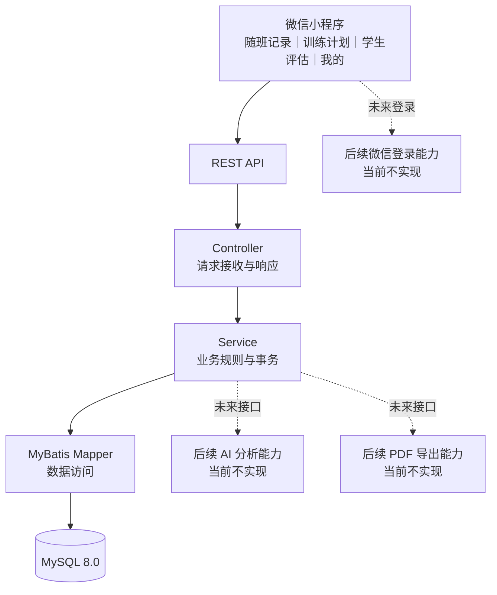
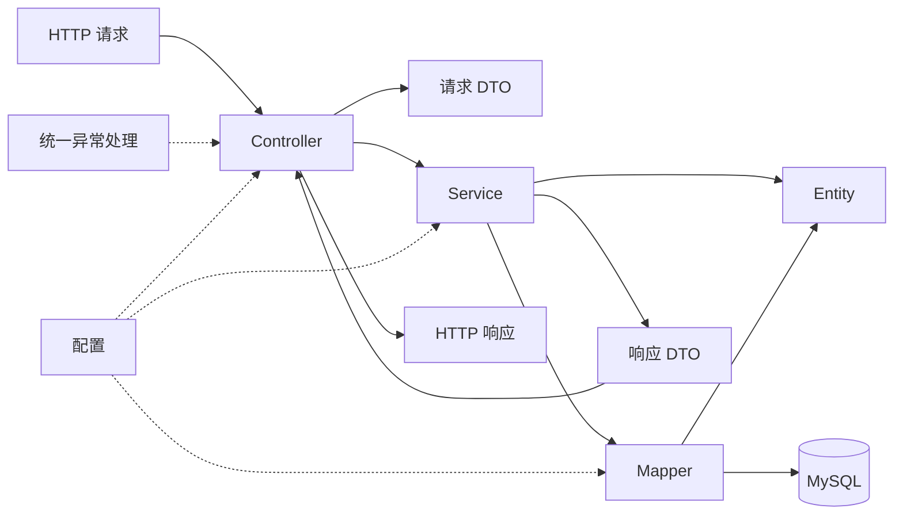
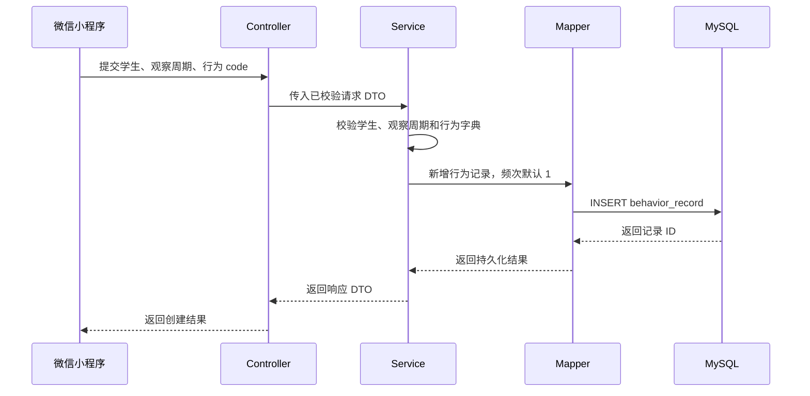
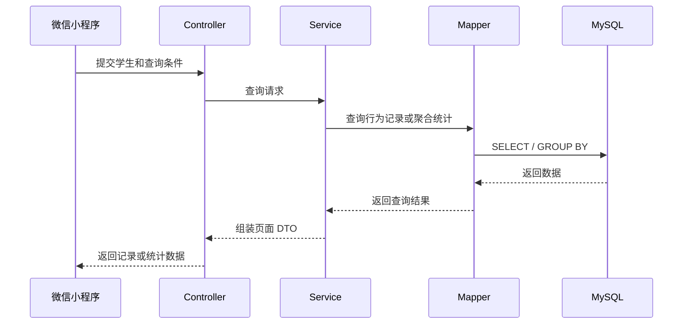

# 成员 B 后端架构设计（任务 2）

## 1. 文档目的

本文档确定特殊教育辅助系统的后端技术路线、业务模块、技术分层、依赖方向和当前实现边界。本文档以任务文件和已确认的数据模型为依据，只完成架构设计，不修改业务代码、数据库脚本或正式 MySQL 数据库。

## 2. 已确认的技术路线

系统采用单体 Spring Boot 应用：

```text
微信小程序
    ↓
REST API
    ↓
Spring Boot 4.1.0
    ↓
Service
    ↓
MyBatis 4.0.0
    ↓
MySQL 8.0
```

当前版本组合：

| 组件 | 版本或选择 | 用途 |
|---|---|---|
| Java | Oracle JDK 25.0.2 | 后端运行和编译 |
| Spring Boot | 4.1.0 | Web 应用和依赖管理 |
| Spring Web | 随 Spring Boot 管理 | REST API |
| Spring Validation | 随 Spring Boot 管理 | 请求参数校验 |
| MyBatis | 4.0.0 Starter | 数据访问和 SQL 映射 |
| MySQL | 8.0.45 | 持久化数据库 |
| Maven | 3.9.16 | 构建和依赖管理 |
| JUnit、MockMvc | 随测试依赖管理 | 自动化测试 |
| Apifox | 已安装桌面版 | API 契约、示例和接口验证 |

技术选型约束：

- 保留 MyBatis，不引入 JPA，避免同时维护两套数据访问方式。
- 当前只运行一个 Spring Boot 进程，不拆分微服务。
- 当前不引入 Spring Security、Redis、Flyway、Docker、消息队列或对象存储。
- 当前不引入 AI SDK 和 PDF 生成依赖。
- 微信登录暂不考虑，只记录为后续可能能力，不设计 `code2Session` 或认证接口。

## 3. 总体架构



当前主调用链只有：

```text
微信小程序 → REST API → Controller → Service → Mapper → MySQL
```

虚线部分只表示前端已经提出的后续方向，不属于当前实现依赖。

## 4. 四个业务模块

业务模块名称与前端四个一级页面保持一致。

### 4.1 随班记录

职责：

- 管理观察周期；
- 提供快速行为记录；
- 补充 ABC 详细记录；
- 保存辅助方式、辅助结果、频次和持续时间；
- 查询历史行为记录；
- 聚合行为统计；
- 按课程匹配需要观察的行为。

对应数据：

- 观察周期；
- 课程、环境和 ABC 字典；
- 行为记录；
- 行为辅助方式；
- 课程行为配置。

### 4.2 训练计划

职责：

- 保存学生训练目标；
- 保存学期初等级和当前等级；
- 保存当前行为表现；
- 管理计划阶段和状态；
- 保存教师备注；
- 提供搜索和筛选所需的数据。

当前只确定模块边界和数据方向，不在本任务中实现训练计划接口。

### 4.3 学生评估

职责：

- 保存教师评价；
- 根据行为记录生成日、周、月统计；
- 提供柱状图、趋势图和行为占比所需的数据；
- 为后续 AI 分析准备数据；
- 为后续 PDF 导出准备页面数据。

行为统计属于数据库查询和 Service 聚合结果，不重复保存统计副本。AI 和 PDF 当前不实现。

### 4.4 我的

职责：

- 提供当前教师信息；
- 提供当前学生信息；
- 提供教师可访问的学生列表；
- 提供学生详细信息；
- 支持教师和学生绑定关系的数据查询。

功能入口由前端固定配置，不建立后端导航表。当前学生选择属于前端应用状态，不写入数据库。

## 5. 页面与后端模块关系

| 前端页面 | 后端模块 | 主要数据方向 |
|---|---|---|
| 随班记录 | 随班记录 | 观察周期、快速记录、ABC 详情、历史记录、统计 |
| 训练计划 | 训练计划 | 训练目标、等级、阶段、状态、备注 |
| 学生评估 | 学生评估 | 教师评价、行为统计、后续 AI 和 PDF 数据 |
| 我的 | 我的 | 当前教师、当前学生、学生信息、绑定关系 |

业务模块用于表达产品职责；Java 源码仍按技术层组织，不在当前任务中改成按业务模块拆包。

## 6. 技术分层与依赖方向



依赖方向必须保持由上到下：

```text
Controller → Service → Mapper → MySQL
```

禁止出现：

- Controller 直接访问 Mapper；
- Mapper 调用 Service；
- Entity 直接作为对外 API 契约；
- DTO 承担数据库持久化职责；
- 在 Controller 中编写统计或事务逻辑。

### 6.1 Controller

负责：

- 接收 HTTP 请求；
- 触发参数校验；
- 调用 Service；
- 返回 DTO 和正确 HTTP 状态。

不负责数据库访问和业务统计。

### 6.2 Service

负责：

- 业务校验；
- 组织多个 Mapper 操作；
- 事务边界；
- 快速记录、详细记录和统计规则；
- Entity 与响应 DTO 之间的转换。

### 6.3 Mapper

负责：

- MyBatis SQL 映射；
- 单表或明确查询的数据访问；
- 将数据库行转换为 Entity 或查询结果对象。

不负责 HTTP 响应、页面状态和业务权限决策。

### 6.4 Entity

负责表达数据库持久化结构。Entity 不作为前端请求和响应结构，避免数据库字段变化直接破坏 API。

### 6.5 DTO

负责：

- 请求字段；
- 响应字段；
- 参数校验注解；
- 页面需要的组合数据。

### 6.6 Exception

负责把业务异常和校验异常转换为稳定的 HTTP 错误响应。具体响应格式在任务 3 的 API 设计中确认。

### 6.7 Config

负责：

- Spring 和 MyBatis 配置；
- 环境变量读取；
- 后续必要的跨域或序列化配置。

当前不配置认证、安全框架和微信登录。

## 7. 目录结构

```text
backend/
├── pom.xml
├── mvnw
├── mvnw.cmd
├── README.md
├── docs/
│   └── openapi.yaml
├── sql/
│   ├── schema.sql
│   └── seed.sql
└── src/
    ├── main/
    │   ├── java/com/specialed/assistant/
    │   │   ├── AssistantApplication.java
    │   │   ├── controller/
    │   │   ├── service/
    │   │   ├── mapper/
    │   │   ├── entity/
    │   │   ├── dto/
    │   │   ├── exception/
    │   │   └── config/
    │   └── resources/
    │       ├── application.yml
    │       ├── application-dev.yml
    │       └── mapper/
    └── test/
        └── java/com/specialed/assistant/
```

说明：Git 不保存空目录，因此 `config` 或 `resources/mapper` 在没有文件时可能不会显示；这不改变架构职责。

## 8. 请求数据流

### 8.1 快速行为记录



### 8.2 历史查询和统计



### 8.3 我的、训练计划和学生评估

- “我的”通过 Service 查询教师、绑定学生和学生信息，再组合为页面 DTO。
- “训练计划”通过 Service 查询和筛选学生训练计划。
- “学生评估”由 Service 查询教师评价，并调用 Mapper 聚合行为记录生成统计 DTO。
- AI 分析和 PDF 导出不进入当前调用链。

## 9. 配置和敏感信息边界

- 数据库地址、用户名和密码通过环境变量传入。
- Git 不提交真实数据库密码或 API Key。
- MySQL 管理员账号只用于本地数据库初始化。
- 应用使用独立数据库账号，不使用 root 运行。
- 默认监听 `127.0.0.1`，不开放局域网和公网访问。
- 当前不保存微信登录凭据，因为微信登录不在当前范围。

## 10. 当前能力与后续能力边界

### 当前架构范围

- 四个业务模块的职责划分；
- REST API 分层；
- MyBatis 数据访问；
- MySQL 持久化；
- DTO、参数校验和统一异常职责；
- 自动化测试结构；
- Apifox/OpenAPI 文档位置。

### 后续可能能力

- 微信登录和 `code2Session`；
- AI 行为分析；
- PDF 导出；
- 离线数据同步；
- 正式认证和权限控制；
- 部署和外网访问。

这些能力不得在没有新任务确认时加入依赖或当前代码。

## 11. 现有代码与目标架构的差异

| 现状 | 目标架构要求 | 后续处理任务 |
|---|---|---|
| 已有健康检查和行为记录 Controller | 保留分层，但需按最终 API 契约核对 | 任务 3、任务 6 |
| 已有 BehaviorService 和 BehaviorMapper | 需按任务 1 数据模型校正 | 任务 4、任务 6 |
| 已有行为 DTO 和 Entity | 当前字段未覆盖观察周期等新设计 | 任务 4 |
| “训练计划”尚无代码 | 架构已预留模块职责 | 后续对应实现任务 |
| “学生评估”尚无代码 | 架构已预留模块职责 | 后续对应实现任务 |
| “我的”尚无代码 | 架构已预留模块职责 | 后续对应实现任务 |
| 当前 OpenAPI 使用旧接口结构 | 需要按任务文件重新确认 API | 任务 3 |
| 当前 SQL 是早期结构 | 需要按任务 1 数据模型修改 | 任务 5 |
| 当前 README 主要为英文 | 后续统一改为中文 | 任务 7 |
| 未集成 AI、PDF、微信登录 | 符合当前边界 | 无需修改 |

## 12. 后续任务必须遵守的架构约束

1. 业务模块统一使用 Controller、Service、Mapper、Entity 和 DTO 分层。
2. Controller 不直接调用 Mapper。
3. Service 管理业务校验和事务。
4. API 字段不直接暴露数据库 Entity。
5. 数据库统计优先由明确 SQL 聚合完成，Service 负责组织结果。
6. Java 和 JSON 使用 lowerCamelCase，MySQL 使用 snake_case。
7. 数据库密码和其他敏感信息只通过环境变量传入。
8. 当前不添加未确认的中间件和外部 SDK。
9. API 路径、响应结构和错误码必须在任务 3 确认后再修改代码。
10. 数据库表必须在任务 5 按任务 1 设计统一修改，不能边写接口边临时加字段。

## 13. 需要跨成员沟通的事项

以下事项不阻塞当前架构：

- 前端确认未来微信登录时前后端的职责边界；
- 成员 C 确认后续 AI 模块的调用协议；
- 前端确认 PDF 由前端还是后端生成；
- 前端确认离线缓存恢复后的同步规则；
- 前端确认开发、测试和正式环境的接口地址切换方式。

## 14. 本任务边界

本任务不执行以下操作：

- 不修改 Java 业务代码；
- 不修改 `schema.sql`、`seed.sql` 或正式数据库；
- 不修改 API 路径和响应结构；
- 不修改 README；
- 不实现训练计划、学生评估或“我的”接口；
- 不实现微信登录、AI 或 PDF；
- 不引入新的运行依赖。
