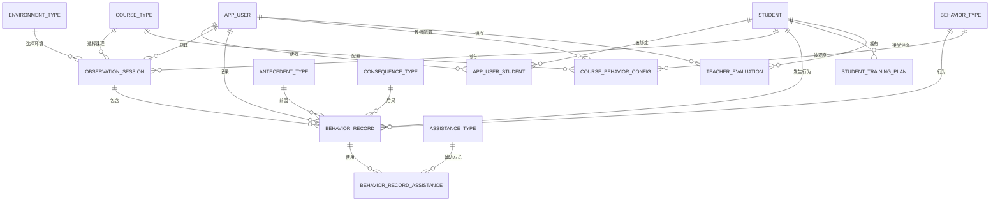

# 成员 B 数据模型设计（任务 1）

> 历史文档：本设计对应旧 V0.3 数据模型，已被 `member-b-v2-data-model.md` 替代，不再作为后续数据库修改依据。

## 1. 文档目的

本文档把任务文件和前端四个一级页面中已经明确提出的数据转换为后端数据结构。本文档只完成设计，不修改 Java 代码、`schema.sql` 或正式 MySQL 数据库。

需求采用以下优先级：

1. 用户已经确认的决定；
2. `7.15-7.16任务.md` 中成员 B 的任务；
3. `产品流程与前端设计.md` 中明确出现的字段和功能；
4. 共享对话仅作为参考，不自动扩大范围。

## 2. 已确认的设计决定

- 四个一级页面都需要字段设计：随班记录、训练计划、学生评估、我的。
- “我的”包含当前教师、当前学生、学生信息和功能入口。
- 建立观察周期数据结构。
- 快速记录时只要求 B 行为，A 前因和 C 后果允许为空。
- 辅助方式允许多选。
- 学生保留障碍类型、备注和当前支持目标。
- 角色只保留资源教师、影子老师和家长，不保留管理员。
- 每次快速点击生成一条行为记录，默认频次为 1。
- 课程和环境使用稳定 code；“其他”使用单独的补充说明。
- 行为记录保留频次和持续时间。

## 3. 数据分类原则

| 分类 | 含义 | 示例 |
|---|---|---|
| 持久化数据 | 需要写入数据库并长期保存 | 教师、学生、行为记录、教师评价 |
| 派生数据 | 根据持久化数据查询或统计得到，不重复保存 | 行为次数、趋势图、行为占比 |
| 前端状态 | 当前页面选择或交互状态，不建立数据库表 | 当前选中学生、当前 Tab、搜索文本 |
| 静态导航 | 固定入口，由前端配置，不建立数据库表 | 帮助、关于系统、退出登录 |
| 待沟通数据 | 前端表达了功能，但存储方式或取值尚未确定 | 训练等级含义、AI 分析是否长期保存 |

## 4. 页面字段映射

### 4.1 随班记录

| 页面内容 | 后端字段或来源 | 分类 |
|---|---|---|
| 日记录、周记录、月记录 | 查询时间范围 | 前端状态/查询条件 |
| 当前日期 | `observation_session.observation_date` | 持久化 |
| 课程 | `observation_session.course_code` | 持久化 |
| 课程“其他”说明 | `observation_session.course_other_description` | 持久化 |
| 环境 | `observation_session.environment_code` | 持久化 |
| 环境“其他”说明 | `observation_session.environment_other_description` | 持久化 |
| 观察周期 | `observation_session.observation_duration_minutes` | 持久化 |
| 本周期行为备注 | `observation_session.period_behavior_remark` | 持久化 |
| 行为名称 | `behavior_type.label` | 持久化字典 |
| 当前发生次数 | 对 `behavior_record.frequency` 求和 | 派生 |
| 行为发生时间 | `behavior_record.record_time` | 持久化 |
| A 前因 | `behavior_record.antecedent_code` | 持久化，可空 |
| B 行为 | `behavior_record.behavior_code` | 持久化，必填 |
| C 后果 | `behavior_record.consequence_code` | 持久化，可空 |
| 辅助方式 | `behavior_record_assistance.assistance_code` | 持久化，多选 |
| “其他”辅助说明 | `behavior_record.assistance_other_description` | 持久化，可空 |
| 辅助结果 | `behavior_record.assistance_result` | 持久化，可空 |
| 行为频次 | `behavior_record.frequency` | 持久化，默认 1 |
| 持续时间 | `behavior_record.duration_seconds` | 持久化，可空 |
| 备注 | `behavior_record.remark` | 持久化，可空 |
| 按课程匹配行为 | `course_behavior_config` | 持久化关联 |
| 教师配置观察行为 | `course_behavior_config.configured_by_user_id` | 持久化关联 |

说明：任务文件示例中的 `scene` 与前端的“环境”表达同一类课堂场景信息，本设计统一使用 `environment_code`，不重复保存两个含义相同的字段。

### 4.2 训练计划

| 页面内容 | 后端字段或来源 | 分类 |
|---|---|---|
| 搜索文本 | 查询参数 | 前端状态/查询条件 |
| 环节筛选 | `student_training_plan.training_context` | 查询条件 |
| 状态筛选 | `student_training_plan.status` | 查询条件 |
| 学期阶段筛选 | `student_training_plan.plan_phase` | 查询条件 |
| 所属学生 | `student_training_plan.student_id` | 持久化 |
| 环节 | `student_training_plan.training_context` | 持久化 |
| 训练目标 | `student_training_plan.training_goal` | 持久化 |
| 学期初评估等级 | `student_training_plan.initial_level` | 持久化 |
| 当前等级 | `student_training_plan.current_level` | 持久化 |
| 现阶段行为表现 | `student_training_plan.current_performance` | 持久化 |
| 计划阶段 | `student_training_plan.plan_phase` | 持久化 |
| 状态 | `student_training_plan.status` | 持久化 |
| 教师备注 | `student_training_plan.teacher_remark` | 持久化，可空 |

当前没有训练等级的完整含义，因此本阶段只设计能够承载页面字段的结构，不编造等级字典。

### 4.3 学生评估

| 页面内容 | 后端字段或来源 | 分类 |
|---|---|---|
| 日报、周报、月报 | `teacher_evaluation.period_type` 和查询范围 | 持久化/查询条件 |
| 日期选择 | `period_start`、`period_end` | 持久化 |
| 教师评价 | `teacher_evaluation.evaluation_text` | 持久化 |
| 行为统计 | 从行为记录聚合 | 派生 |
| 柱状图 | 行为频次统计结果 | 派生 |
| 趋势图 | 按日期聚合行为记录 | 派生 |
| 行为占比图 | 按行为类型聚合 | 派生 |
| AI 分析 | 后续 AI 模块返回 | 待沟通，不默认持久化 |
| 日报、周报、月报导出 | 导出命令及页面数据 | 前端操作，不默认建立文件表 |
| 分享对象 | 前端分享操作 | 前端操作，不建立人员分享表 |

### 4.4 我的

#### 当前教师

| 页面内容 | 后端字段 | 分类 |
|---|---|---|
| 头像 | `app_user.avatar` | 持久化 |
| 姓名 | `app_user.name` | 持久化 |
| 学校 | `app_user.school` | 持久化 |
| 职务 | `app_user.position` | 持久化 |
| 角色 | `app_user.role` | 持久化 |

#### 当前学生

| 页面内容 | 后端字段或来源 | 分类 |
|---|---|---|
| 学生 ID | `student.id` | 持久化 |
| 学生姓名 | `student.name` | 持久化 |
| 当前选择状态 | 当前页面或应用状态中的 `currentStudentId` | 前端状态 |
| 可切换学生列表 | `app_user_student` 关联查询 | 派生 |

#### 学生信息

| 页面内容 | 后端字段 | 分类 |
|---|---|---|
| 姓名 | `student.name` | 持久化 |
| 年龄 | `student.age` | 持久化 |
| 班级 | `student.class_name` | 持久化 |
| 障碍类型 | `student.disability_type` | 持久化 |
| 当前支持目标 | `student.support_goal` | 持久化 |
| 备注 | `student.remark` | 持久化 |

#### 功能入口

| 功能入口 | 数据处理方式 |
|---|---|
| 学生信息 | 前端固定路由 |
| 教师信息 | 前端固定路由 |
| 导出记录 | 前端固定路由，调用后续导出能力 |
| 帮助 | 前端固定路由 |
| 关于系统 | 前端固定路由 |
| 退出登录 | 前端操作 |

功能入口是静态导航，不创建数据库表。

## 5. ER 图

## 6. 持久化表字段设计

### 6.1 `app_user` 当前教师/用户

| 字段 | 建议类型 | 必填 | 说明 |
|---|---|---|---|
| `id` | BIGINT UNSIGNED | 是 | 主键 |
| `avatar` | VARCHAR(500) | 否 | 头像地址 |
| `name` | VARCHAR(64) | 是 | 姓名 |
| `school` | VARCHAR(128) | 否 | 学校 |
| `position` | VARCHAR(64) | 否 | 职务 |
| `role` | ENUM | 是 | 三种已确认角色之一 |

角色取值：

- `RESOURCE_TEACHER`
- `SHADOW_TEACHER`
- `PARENT`

### 6.2 `student` 学生

| 字段 | 建议类型 | 必填 | 说明 |
|---|---|---|---|
| `id` | BIGINT UNSIGNED | 是 | 主键 |
| `name` | VARCHAR(64) | 是 | 姓名 |
| `age` | TINYINT UNSIGNED | 否 | 年龄 |
| `class_name` | VARCHAR(64) | 否 | 班级，避免使用保留字 `class` |
| `disability_type` | VARCHAR(64) | 否 | 障碍类型 |
| `support_goal` | VARCHAR(255) | 否 | 当前支持目标 |
| `remark` | VARCHAR(500) | 否 | 学生备注 |

### 6.3 `app_user_student` 用户与学生绑定

| 字段 | 建议类型 | 必填 | 说明 |
|---|---|---|---|
| `user_id` | BIGINT UNSIGNED | 是 | 关联用户 |
| `student_id` | BIGINT UNSIGNED | 是 | 关联学生 |

联合主键为 `user_id + student_id`。当前选中学生属于前端状态，不写入该表。

### 6.4 基础 code 字典

以下字典表采用相同的最小字段结构：

- `course_type`
- `environment_type`
- `antecedent_type`
- `behavior_type`
- `consequence_type`
- `assistance_type`

| 字段 | 建议类型 | 必填 | 说明 |
|---|---|---|---|
| `code` | VARCHAR(64) | 是 | 稳定英文 code，主键或唯一键 |
| `label` | VARCHAR(64) | 是 | 中文显示名称 |

### 6.5 `observation_session` 观察周期

| 字段 | 建议类型 | 必填 | 说明 |
|---|---|---|---|
| `id` | BIGINT UNSIGNED | 是 | 主键 |
| `student_id` | BIGINT UNSIGNED | 是 | 被观察学生 |
| `creator_id` | BIGINT UNSIGNED | 是 | 创建观察周期的教师 |
| `observation_date` | DATE | 是 | 观察日期 |
| `course_code` | VARCHAR(64) | 是 | 课程 code |
| `course_other_description` | VARCHAR(255) | 否 | 课程为“其他”时填写 |
| `environment_code` | VARCHAR(64) | 是 | 环境 code，同时承载任务示例中的 scene |
| `environment_other_description` | VARCHAR(255) | 否 | 环境为“其他”时填写 |
| `observation_duration_minutes` | SMALLINT UNSIGNED | 是 | 20、30、40、45、60 或自定义分钟数 |
| `period_behavior_remark` | VARCHAR(1000) | 否 | 本周期行为备注 |

### 6.6 `behavior_record` 行为记录

| 字段 | 建议类型 | 必填 | 说明 |
|---|---|---|---|
| `id` | BIGINT UNSIGNED | 是 | 主键 |
| `observation_session_id` | BIGINT UNSIGNED | 是 | 所属观察周期 |
| `student_id` | BIGINT UNSIGNED | 是 | 学生，保留任务文件要求的 student_id |
| `creator_id` | BIGINT UNSIGNED | 是 | 记录人 |
| `record_time` | DATETIME(3) | 是 | 行为发生时间 |
| `antecedent_code` | VARCHAR(64) | 否 | A 前因，快速记录时可空 |
| `behavior_code` | VARCHAR(64) | 是 | B 行为 |
| `consequence_code` | VARCHAR(64) | 否 | C 后果，快速记录时可空 |
| `assistance_result` | ENUM | 否 | 辅助结果 |
| `assistance_other_description` | VARCHAR(255) | 否 | 选择“其他”辅助方式时填写 |
| `frequency` | INT UNSIGNED | 是 | 默认 1 |
| `duration_seconds` | INT UNSIGNED | 否 | 持续时间，单位秒 |
| `remark` | VARCHAR(500) | 否 | 详细备注 |

辅助结果取值：

- `SUCCESS`
- `PARTIAL_SUCCESS`
- `FAILED`

### 6.7 `behavior_record_assistance` 行为辅助方式

| 字段 | 建议类型 | 必填 | 说明 |
|---|---|---|---|
| `behavior_record_id` | BIGINT UNSIGNED | 是 | 行为记录 |
| `assistance_code` | VARCHAR(64) | 是 | 辅助方式 code |

联合主键为 `behavior_record_id + assistance_code`。

### 6.8 `course_behavior_config` 课程行为配置

| 字段 | 建议类型 | 必填 | 说明 |
|---|---|---|---|
| `course_code` | VARCHAR(64) | 是 | 课程 code |
| `behavior_code` | VARCHAR(64) | 是 | 需要观察的行为 code |
| `configured_by_user_id` | BIGINT UNSIGNED | 否 | 为空表示系统默认；有值表示教师自行配置 |

教师配置是否还需要按学生区分，等待前端确认后再决定是否增加 `student_id`。

### 6.9 `student_training_plan` 学生训练计划

| 字段 | 建议类型 | 必填 | 说明 |
|---|---|---|---|
| `id` | BIGINT UNSIGNED | 是 | 主键 |
| `student_id` | BIGINT UNSIGNED | 是 | 所属学生 |
| `training_context` | VARCHAR(128) | 是 | 环节 |
| `training_goal` | VARCHAR(255) | 是 | 训练目标 |
| `initial_level` | VARCHAR(32) | 否 | 学期初评估等级，取值待确认 |
| `current_level` | VARCHAR(32) | 否 | 当前等级，取值待确认 |
| `current_performance` | VARCHAR(1000) | 否 | 现阶段行为表现 |
| `plan_phase` | VARCHAR(64) | 否 | 计划阶段 |
| `status` | ENUM | 是 | 计划状态 |
| `teacher_remark` | VARCHAR(1000) | 否 | 教师备注 |

状态取值来自前端：

- `NOT_STARTED`
- `IN_PROGRESS`
- `COMPLETED`
- `PAUSED`

### 6.10 `teacher_evaluation` 教师评价

| 字段 | 建议类型 | 必填 | 说明 |
|---|---|---|---|
| `id` | BIGINT UNSIGNED | 是 | 主键 |
| `student_id` | BIGINT UNSIGNED | 是 | 所属学生 |
| `teacher_id` | BIGINT UNSIGNED | 是 | 填写教师 |
| `period_type` | ENUM | 是 | 日、周、月 |
| `period_start` | DATE | 是 | 评价开始日期 |
| `period_end` | DATE | 是 | 评价结束日期 |
| `evaluation_text` | VARCHAR(2000) | 否 | 教师评价 |

周期类型：

- `DAILY`
- `WEEKLY`
- `MONTHLY`

行为统计由行为记录计算；AI 分析和 PDF 文件是否持久化尚未确定，因此不进入当前表结构。

## 7. 快速记录与详细记录规则

### 快速记录

- 前端选择当前学生、课程、环境和观察周期。
- 点击某个行为的 `+`。
- 后端创建一条行为记录。
- `behavior_code` 为当前行为，`record_time` 自动记录，`frequency = 1`。
- A、C、辅助方式、辅助结果、持续时间和备注均可暂时为空。

### 详细记录

- 在已有快速记录上补充 A、C、辅助方式、辅助结果、频次、持续时间和备注。
- 辅助方式通过关联表支持多选。

### 行为次数

页面显示次数通过汇总当前观察周期内对应行为记录的 `frequency` 得到，不建立单独的“当前次数”字段。

## 8. 当前数据库与目标设计的差异

| 当前结构 | 差异 | 后续处理任务 |
|---|---|---|
| `app_user` | 缺少头像、学校、职务；多出未批准的 `ADMIN` | 数据库创建任务修改 |
| `student` | 缺少障碍类型和备注 | 数据库创建任务修改 |
| 无用户学生关联表 | 无法表达绑定和学生切换列表 | 数据库创建任务新增 |
| 无课程和环境字典 | 课程、环境没有稳定 code 表 | 数据库创建任务新增 |
| 无观察周期表 | 课程、环境、观察时长和本周期行为备注无归属 | 数据库创建任务新增 |
| `behavior_record` | 当前 A/B/C 均必填，与快速记录冲突 | 数据库创建任务修改 |
| `behavior_record` | 缺少观察周期、辅助信息、频次和持续时间 | 数据库创建任务修改 |
| 无辅助方式关联表 | 不能表示多选辅助方式 | 数据库创建任务新增 |
| 无课程行为配置 | 不能按课程匹配或由教师配置行为 | 数据库创建任务新增 |
| 无训练计划结构 | 无法承载训练计划页面 | 数据库创建任务新增 |
| 无教师评价结构 | 无法保存学生评估页面的教师评价 | 数据库创建任务新增 |

当前表中的 `created_at` 等现有技术字段不属于本任务新增内容；是否继续保留，在正式数据库修改前单独确认。

## 9. 后续修改清单

本任务验收通过后，后续数据库创建任务需要：

1. 删除 `ADMIN` 角色；
2. 补充教师和学生字段；
3. 新增用户学生关联、课程、环境和观察周期结构；
4. 调整行为记录的可空规则并增加辅助、频次和持续时间；
5. 新增辅助方式多选关联；
6. 新增课程行为配置；
7. 新增训练计划和教师评价结构；
8. 更新字典种子数据；
9. 使用正式 MySQL 管理员凭据执行并验证最终脚本。

## 10. 需要跨成员沟通的事项

以下事项不阻塞本数据模型设计，但在相关功能进入实现前必须确认：

- 前端说明训练等级的完整取值及含义。
- 前端确认教师自定义行为是否还要按学生区分。
- 前端和成员 C 提供最终课程、环境及 A/B/C 字典。
- 成员 C 确认 AI 模块的最终历史数据字段。
- 前端与成员 C 确认 AI 分析是否长期保存。
- 前端确认日报、周报、月报是否保存快照。
- 前端确认 PDF 是即时生成还是保存导出记录。
- 前端确认离线同步是否提供客户端唯一 ID。
- 前端确认学生年龄以后是否改为出生日期。

## 11. 本任务边界

本任务不执行以下操作：

- 不修改正式数据库；
- 不修改 `schema.sql` 或 `seed.sql`；
- 不修改 Java 实体、Mapper、Service 或 Controller；
- 不实现 AI、PDF、微信登录或复杂权限；
- 不自行编造未提供的字典和训练目标内容。
