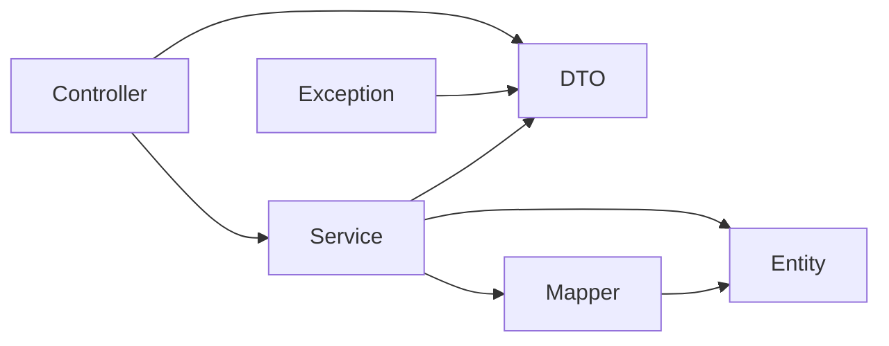

# 成员 B 后端项目初始化与分层说明（任务 4）

## 1. 文档目的

本文档记录成员 B 后端项目的初始化状态、目录职责、分层依赖、配置边界和测试基线，作为后续数据库创建与接口框架实现的工程基础。

本任务只整改公共项目基础，不提前修改最终业务 DTO、Entity、Mapper、Service、Controller 或 SQL。

## 2. 需求依据

本任务依据：

1. 用户在当前对话中确认的任务 4 执行范围；
2. `7.15-7.16任务.md` 中成员 B 的“后端项目初始化”和分层要求；
3. 已验收的后端架构设计；
4. 已验收的数据模型设计；
5. 已验收的核心接口与 Apifox 设计。

## 3. 当前工程基线

| 项目 | 当前值 |
|---|---|
| Java | 25.0.2 |
| Maven Wrapper | 3.9.16 |
| Spring Boot | 4.1.0 |
| MyBatis Spring Boot Starter | 4.0.0 |
| MySQL Connector | 由 Spring Boot 依赖管理 |
| 构建方式 | Maven |
| 打包方式 | JAR |
| 根包 | `com.specialed.assistant` |
| 默认服务地址 | `127.0.0.1:8080` |
| 默认配置环境 | `dev` |

项目通过 `mvnw` 和 `mvnw.cmd` 固定 Maven 版本。开发人员不需要依赖系统全局 Maven。

## 4. Maven 基础设置

`pom.xml` 当前明确设置：

```xml
<java.version>25</java.version>
<project.build.sourceEncoding>UTF-8</project.build.sourceEncoding>
<project.reporting.outputEncoding>UTF-8</project.reporting.outputEncoding>
<maven.compiler.parameters>true</maven.compiler.parameters>
```

作用：

- Java 源码按 Java 25 编译；
- 源文件、资源和测试报告统一使用 UTF-8；
- 保留方法参数名称，便于请求参数校验和错误信息定位；
- Windows 与其他环境之间减少中文编码差异。

当前依赖只包括：

- Spring Web；
- Jakarta Validation；
- MyBatis；
- MySQL Connector；
- Spring Boot 测试支持。

当前不引入：

- JPA；
- H2；
- Redis；
- 消息队列；
- 认证或安全框架；
- 微信 SDK；
- AI SDK；
- PDF 组件；
- ArchUnit；
- 未经确认的中间件。

## 5. 项目目录

```text
backend/
├── .mvn/
│   └── wrapper/
│       └── maven-wrapper.properties
├── docs/
│   └── openapi.yaml
├── sql/
│   ├── schema.sql
│   └── seed.sql
├── src/
│   ├── main/
│   │   ├── java/com/specialed/assistant/
│   │   │   ├── AssistantApplication.java
│   │   │   ├── controller/
│   │   │   ├── service/
│   │   │   ├── mapper/
│   │   │   ├── entity/
│   │   │   ├── dto/
│   │   │   └── exception/
│   │   └── resources/
│   │       ├── application.yml
│   │       └── application-dev.yml
│   └── test/
│       └── java/com/specialed/assistant/
├── mvnw
├── mvnw.cmd
├── pom.xml
└── README.md
```

`config/` 和 `resources/mapper/` 当前没有必须提交的文件，因此不创建空目录。Git 不保存空目录，这不影响已确认的架构：

- 出现确实需要的 Spring 配置类时再创建 `config/`；
- 任务 6 把复杂 MyBatis 查询转为 XML 时再创建 `resources/mapper/`。

## 6. 技术分层

### 6.1 Controller

职责：

- 接收 HTTP 请求；
- 读取路径、查询参数和请求体；
- 触发 Jakarta Validation；
- 调用 Service；
- 返回响应 DTO 和 HTTP 状态码。

禁止：

- 直接调用 Mapper；
- 编写 SQL；
- 处理事务；
- 在 Controller 中完成行为统计；
- 直接返回数据库 Entity。

### 6.2 Service

职责：

- 组织业务流程；
- 校验学生、教师、观察周期和字典值；
- 管理事务；
- 调用一个或多个 Mapper；
- 把 Entity 或查询结果转换为响应 DTO；
- 组织统计结果。

禁止：

- 处理 HTTP 请求对象；
- 依赖 Controller；
- 返回数据库异常或连接信息给前端。

### 6.3 Mapper

职责：

- 定义数据库查询和写入方法；
- 接收 Service 提供的持久化参数；
- 返回 Entity 或专用查询结果；
- 执行明确的统计聚合。

后续复杂筛选和多表统计使用 MyBatis XML。Mapper 接口最终只保留方法定义，不继续堆叠长 SQL 注解。

禁止：

- 依赖 Controller；
- 调用 Service；
- 处理 HTTP 状态码；
- 执行业务流程；
- 直接承担对外 API 响应职责。

### 6.4 Entity

职责：

- 表达 MySQL 持久化结构；
- 使用 Java `lowerCamelCase` 对应 MySQL `snake_case`；
- 作为 Mapper 与 Service 之间的数据载体。

Entity 不作为前端请求或响应结构。

### 6.5 DTO

职责：

- 表达请求体；
- 表达响应体；
- 表达接口查询结果；
- 承载字段校验规则。

DTO 不承担数据库写入职责，不包含 SQL。

### 6.6 Exception

职责：

- 定义稳定错误码；
- 表达业务资源不存在；
- 把校验异常转换为 `400`；
- 把资源不存在转换为 `404`；
- 把未预期异常转换为安全的 `500`；
- 防止敏感信息进入 HTTP 响应。

### 6.7 Config

只有出现实际公共配置时才创建，例如：

- 必要的序列化配置；
- 必要的 MyBatis 扫描配置；
- 后续确认的跨域配置。

当前不为占位目的创建空配置类。

## 7. 依赖方向



允许方向：

- Controller → Service；
- Service → Mapper；
- Controller/Service → DTO；
- Service/Mapper → Entity；
- 全局异常处理 → ErrorResponse。

禁止方向：

- Controller → Mapper；
- Mapper → Service；
- Service → Controller；
- Entity → Controller/Service/Mapper；
- DTO → Mapper。

现有 Mapper 直接返回旧响应 DTO 的问题将在任务 6 最终接口改造时移除，避免在任务 5 数据库创建前重复修改两次。

## 8. 统一错误结构

### 8.1 响应格式

```json
{
  "code": "VALIDATION_ERROR",
  "message": "请求参数不合法"
}
```

对应 Java 类型：

```text
dto/ErrorResponse
exception/ErrorCode
```

### 8.2 错误码

| HTTP 状态 | 错误码 | 用途 |
|---|---|---|
| `400` | `VALIDATION_ERROR` | 请求体、路径、查询参数或业务输入不合法 |
| `404` | `RESOURCE_NOT_FOUND` | 学生、教师、观察周期或记录不存在 |
| `500` | `INTERNAL_ERROR` | 未预期服务异常 |

### 8.3 校验错误

以下异常统一转换为 `VALIDATION_ERROR`：

- `IllegalArgumentException`；
- `MethodArgumentNotValidException`；
- `HandlerMethodValidationException`；
- `MethodArgumentTypeMismatchException`；
- `HttpMessageNotReadableException`；
- `ConstraintViolationException`。

对于请求体字段校验，响应指出失败字段但不返回 Java 类名、堆栈或内部实现。

### 8.4 资源不存在

`ResourceNotFoundException` 转换为：

- HTTP `404`；
- `code = RESOURCE_NOT_FOUND`；
- 由业务层提供的安全中文说明。

### 8.5 未预期异常

其他异常统一处理：

- HTTP `500`；
- `code = INTERNAL_ERROR`；
- `message = 服务内部错误`。

详细异常只通过后端日志记录。HTTP 响应不得包含：

- SQL；
- 数据库连接串；
- 数据库账号或密码；
- 堆栈；
- 本机文件路径；
- Java 内部类名。

## 9. 配置和敏感信息边界

### 9.1 `application.yml`

只保存公共配置：

- 应用名称；
- 默认 profile；
- 服务地址；
- 服务端口。

### 9.2 `application-dev.yml`

保存本地开发环境的数据源结构，但密码只通过环境变量读取：

```text
DB_URL
DB_USERNAME
DB_PASSWORD
```

Git 不提交真实密码或 `.env` 文件。

### 9.3 当前限制

- 应用默认只监听 `127.0.0.1`；
- 当前不开放局域网或公网；
- 当前没有微信登录凭据；
- 当前没有 AI Key；
- 当前没有认证令牌配置。

## 10. 测试结构

当前测试分为：

- Controller 切片测试；
- Service 单元测试。

任务 4 为异常结构补充了：

- 参数错误返回 `VALIDATION_ERROR`；
- 资源不存在返回 `RESOURCE_NOT_FOUND`；
- 未预期异常返回 `INTERNAL_ERROR`；
- 未预期异常详情不进入响应。

正式数据库建立后，在任务 5 或任务 6 增加 Mapper/MySQL 集成测试。

## 11. Mockito 警告

Java 25 运行 Mockito 时会提示动态加载 Java Agent 的兼容性警告。当前：

- 测试仍然全部通过；
- 警告不影响当前构建；
- 本任务不增加额外测试 Agent 配置；
- 建立 CI 或相关 JDK 行为变为错误时再处理。

## 12. 本任务保留的现有实现

为保持当前工程持续可编译和可测试，本任务暂时保留旧行为接口实现，包括：

- 旧 `CreateBehaviorRequest`；
- 旧 `BehaviorRecordResponse`；
- 旧 `BehaviorRecordEntity`；
- 旧 `BehaviorMapper` SQL 注解；
- 旧 `BehaviorService`；
- 现有三个行为相关 Controller 方法。

这些代码不代表最终接口契约。最终接口以任务 3 的 OpenAPI 为准。

## 13. 后续任务边界

### 任务 5

- 按已验收数据模型修改 `schema.sql`；
- 修改 `seed.sql`；
- 创建和验证正式 MySQL 数据库；
- 不在数据库脚本中保存真实密码。

### 任务 6

- 按任务 3 OpenAPI 修改业务 DTO；
- 按任务 5 表结构修改 Entity；
- 实现观察周期接口；
- 实现快速和详细行为记录；
- 实现编辑和删除；
- 实现筛选和统计；
- 把复杂查询迁移到 MyBatis XML；
- 消除 Mapper 直接返回 API DTO 的旧依赖；
- 添加 Controller、Service 和 Mapper 测试。

### 任务 7

- 把 README 改为中文；
- 汇总运行、配置和验收步骤；
- 完成本阶段最终验证。

## 14. 需要与其他成员沟通的事项

任务 4 没有新增阻塞事项。

前端联调前仍需遵守任务 3 已经记录的内容：

- 请求发送稳定 code；
- 保存快速记录返回的记录 ID；
- 使用已确认的查询参数名称；
- 按统一错误码处理失败响应。

## 15. 本任务未执行的内容

- 未修改业务请求和响应字段；
- 未修改 Entity；
- 未修改 Mapper SQL；
- 未修改 Service 业务流程；
- 未新增观察周期接口；
- 未修改数据库脚本；
- 未连接正式 MySQL；
- 未修改 README；
- 未实现训练计划、学生评估或“我的”接口；
- 未实现微信登录、认证、AI 或 PDF；
- 未引入新运行依赖。
